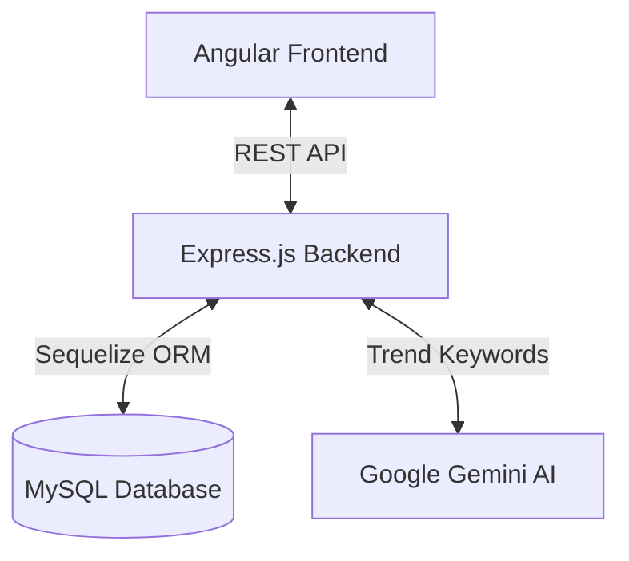

# Architecture & System Design: AI Pulse Predictive Inventory

AI Pulse is a full-stack predictive inventory management system. It uses classical ERP inventory tracking combined with generative AI (Google Gemini) to forecast demand spikes based on consumer trend keywords.

## High-Level Architecture

### 1. Frontend (Angular)
- **Framework:** Angular 17+ with standalone components.
- **Routing:** Lazy-loaded modules for Dashboard, Products, and Analytics to keep the initial bundle size small.
- **State:** Uses RxJS BehaviorSubjects for global state management (e.g., active user, cart/order staging).
- **Styling:** Custom CSS with a focus on Glassmorphism and responsive design.

### 2. Backend (Node.js / Express)
- **Architecture:** Layered architecture (Controllers → Services → Models) to keep business logic decoupled from HTTP transport.
- **Security:** Helmet for HTTP headers, generic rate limiting (except for high-throughput reads), and JWT-based RBAC (Role-Based Access Control) for admin vs. staff endpoints.
- **Error Handling:** A centralized `errorHandler.middleware.js` acts as a translation layer, catching deep Sequelize errors or JWT expiration errors and converting them into clean, standardized JSON HTTP responses.

### 3. Database (MySQL / Sequelize)
- **Data Integrity:** Strict foreign key constraints and optimistic locking on critical inventory rows to prevent race conditions during concurrent restocks.
- **Soft Deletes:** `paranoid: true` is configured globally in Sequelize. Records are never deleted; a `deletedAt` timestamp is set instead, allowing for audit trails.

### 4. AI Engine (TrendAnalysisService)
- Operators input consumer trend keywords (e.g., "Winter Storm Approaching").
- The backend sends a highly structured prompt to **Gemini 2.5 Flash**, enforcing a strict JSON array response of product SKUs likely to experience demand spikes.
- The service cross-references these SKUs against the live MySQL inventory.
- If a predicted SKU is below the `RESTOCK_THRESHOLD`, the system persists a `TrendSignal` to the database, alerting buyers.
